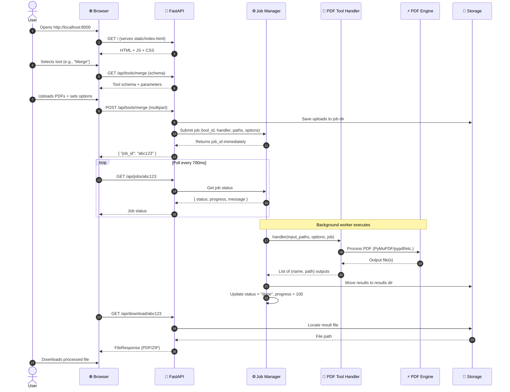
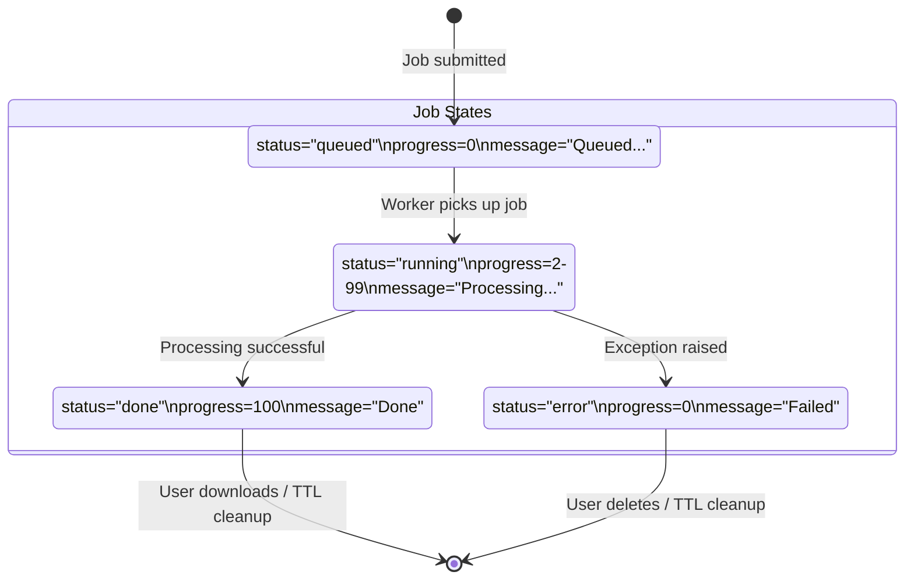

# PDF Studio — Offline PDF Toolkit


A **Sejda-like** offline PDF processing desktop application built with **FastAPI** and **Python**. Process PDFs locally with no cloud uploads. Includes **43 tools** for merging, splitting, rotating, converting, compressing, OCR, editing, securing, and more.

---

## 🎯 Key Features

| Feature | Description |
|---------|-------------|
| **🔒 100% Offline** | All processing happens locally — no files leave your machine |
| **🛠️ 43 Tools** | Merge, split, convert, compress, OCR, edit, secure, and more |
| **⚡ Fast & Lightweight** | Native Python + PyMuPDF/pypdf for high performance |
| **🎨 Modern Web UI** | Clean, responsive interface with drag-and-drop |
| **🔌 REST API** | Full OpenAPI/Swagger documentation at `/api` |
| **📦 Zero Config** | Double-click `run.bat` to start instantly |

---

## 🏗️ Architecture Overview

### High-Level System Architecture

```mermaid
flowchart TB
    subgraph Client["🖥️ Client (Browser)"]
        UI["Web UI (HTML/CSS/JS)"]
        API_DOCS["Swagger UI / ReDoc<br/>/api & /api/redoc"]
    end

    subgraph Server["🐍 FastAPI Server (localhost:8000)"]
        ROUTER["API Router"]
        
        subgraph Endpoints["API Endpoints"]
            TOOLS_EP["GET /api/tools<br/>List 43 tools with schemas"]
            CATS_EP["GET /api/categories<br/>7 tool categories"]
            RUN_EP["POST /api/tools/{id}<br/>Execute PDF tool"]
            JOBS_EP["GET /api/jobs/{id}<br/>Poll job status"]
            DL_EP["GET /api/download/{id}<br/>Download results"]
            EDIT_EP["POST /api/editor/render<br/>PDF → PNG preview"]
            PREV_EP["GET /api/preview/{id}<br/>Preview status"]
            PREV_RES["POST /api/preview/result/{id}<br/>Render output preview"]
        end
        
        subgraph Core["Core Services"]
            JOBS["Job Manager<br/>(ThreadPoolExecutor)"]
            STORAGE["Storage Service<br/>(uploads/results + TTL)"]
        end
    end

    subgraph Tools["📦 PDF Tools (43 handlers)"]
        FILES["files.py<br/>10 tools"]
        PAGES["pages.py<br/>7 tools"]
        EDIT["edit.py<br/>2 tools"]
        CONVERT["convert.py<br/>10 tools"]
        SCAN["scan.py<br/>3 tools"]
        SECURITY["security.py<br/>7 tools"]
        MISC["misc.py<br/>4 tools"]
    end

    subgraph Engines["🔧 PDF Engines"]
        PYMUPDF["PyMuPDF (fitz)<br/>Rendering, editing, OCR prep"]
        PYPDF["pypdf<br/>Structure manipulation"]
        PIL["Pillow<br/>Image processing"]
        RAPIDOCR["RapidOCR<br/>Offline OCR"]
        WEASY["WeasyPrint<br/>HTML → PDF"]
        PDF2DOCX["pdf2docx<br/>PDF → Word"]
        OTHER["pdfplumber, openpyxl,<br/>python-pptx, reportlab"]
    end

    UI --> ROUTER
    API_DOCS --> ROUTER
    ROUTER --> TOOLS_EP
    ROUTER --> CATS_EP
    ROUTER --> RUN_EP
    ROUTER --> JOBS_EP
    ROUTER --> DL_EP
    ROUTER --> EDIT_EP
    ROUTER --> PREV_EP
    ROUTER --> PREV_RES
    
    RUN_EP --> JOBS
    EDIT_EP --> JOBS
    PREV_RES --> JOBS
    JOBS --> STORAGE
    JOBS --> FILES
    JOBS --> PAGES
    JOBS --> EDIT
    JOBS --> CONVERT
    JOBS --> SCAN
    JOBS --> SECURITY
    JOBS --> MISC
    
    FILES --> PYMUPDF
    FILES --> PYPDF
    PAGES --> PYMUPDF
    EDIT --> PYMUPDF
    CONVERT --> PYMUPDF
    CONVERT --> PYPDF
    CONVERT --> PIL
    CONVERT --> WEASY
    CONVERT --> PDF2DOCX
    CONVERT --> OTHER
    SCAN --> PYMUPDF
    SCAN --> PIL
    SCAN --> RAPIDOCR
    SECURITY --> PYMUPDF
    SECURITY --> PYPDF
    MISC --> PYMUPDF
    MISC --> PYPDF
    MISC --> OTHER
```



### Request Flow Diagram



### Job Processing Lifecycle



### Project Structure

```mermaid
graph TD
    ROOT["pdf-studio/"]
    
    ROOT --> APP["app.py<br/>FastAPI entry point"]
    ROOT --> REQ["requirements.txt"]
    ROOT --> RUN["run.bat<br/>Double-click launcher"]
    ROOT --> README["README.md"]
    
    ROOT --> STATIC["static/"]
    STATIC --> IDX["index.html<br/>SPA entry"]
    STATIC --> CSS["css/style.css<br/>Modern glassmorphism UI"]
    STATIC --> JS["js/app.js<br/>SPA router + tool logic"]
    
    ROOT --> DATA["data/"]
    DATA --> UPLOADS["uploads/<br/>Temporary uploads (per job)"]
    DATA --> RESULTS["results/<br/>Processed outputs (per job)"]
    
    ROOT --> SERVICES["services/"]
    SERVICES --> JOBS["jobs.py<br/>ThreadPoolExecutor + Job queue"]
    SERVICES --> STORAGE["storage.py<br/>File storage + TTL cleanup"]
    
    ROOT --> PDF_TOOLS["pdf_tools/"]
    PDF_TOOLS --> INIT["__init__.py<br/>Registry: 43 tools + schemas"]
    PDF_TOOLS --> BASE["base.py<br/>Shared helpers"]
    PDF_TOOLS --> FILES["files.py<br/>10 file-level tools"]
    PDF_TOOLS --> PAGES["pages.py<br/>7 page-level tools"]
    PDF_TOOLS --> EDIT["edit.py<br/>Editor + forms"]
    PDF_TOOLS --> CONVERT["convert.py<br/>10 conversion tools"]
    PDF_TOOLS --> SCAN["scan.py<br/>Compress, deskew, OCR"]
    PDF_TOOLS --> SECURITY["security.py<br/>7 security tools"]
    PDF_TOOLS --> MISC["misc.py<br/>4 misc tools"]
```



---

## 🚀 Quick Start

### Option 1: Double-Click Launcher (Easiest)

```bash
# 1. Clone the repository
git clone https://github.com/your-username/pdf-studio.git
cd pdf-studio

# 2. Double-click run.bat
#    → Opens terminal, activates venv, starts server
#    → Browser opens at http://127.0.0.1:8000
```

### Option 2: Manual Installation

```bash
# 1. Clone
git clone https://github.com/your-username/pdf-studio.git
cd pdf-studio

# 2. Create virtual environment
python -m venv venv

# Windows
venv\Scripts\activate.bat

# macOS/Linux
source venv/bin/activate

# 3. Install dependencies
pip install -r requirements.txt

# 4. Start the server
python app.py
# or
python -m uvicorn app:app --host 127.0.0.1 --port 8000 --log-level info
```

### Option 3: Docker (Coming Soon)

```bash
docker build -t pdf-studio .
docker run -p 8000:8000 pdf-studio
```

---

## 🛠️ Available Tools (43 Total)

### 📂 Files (10 tools)
| Tool | Description |
|------|-------------|
| **Merge** | Combine multiple PDFs and images into one document |
| **Alternate & Mix** | Mix pages from 2+ documents, alternating between them |
| **Organize** | Reorder pages: `3,1-2,5` |
| **Split** | Split by ranges or extract every page separately |
| **Split by Bookmarks** | Extract chapters based on table of contents |
| **Split in Half** | Split 2-page layouts (A3→2×A4, A4→2×A5) |
| **Split by Size** | Create smaller documents with max file size |
| **Split by Text** | Extract documents when marker text appears |
| **Extract Pages** | Get new document with only desired pages |
| **Delete Pages** | Remove pages from a PDF |

### 📄 Pages (7 tools)
| Tool | Description |
|------|-------------|
| **Rotate** | Rotate pages 90°/180°/270° permanently |
| **Crop** | Trim margins, change page size |
| **Resize** | Add margins/padding, change to A4/A3/Letter/custom |
| **Flip** | Mirror horizontally or vertically |
| **N-up** | Multiple pages per sheet (2-up, 4-up, etc.) |
| **Grayscale** | Convert to grayscale |
| **Remove Annotations** | Batch remove highlights, strikeouts, etc. |

### ✏️ Edit & Sign (2 tools)
| Tool | Description |
|------|-------------|
| **PDF Editor** | Canvas editor: add text, images, shapes, drawings, signatures |
| **Create Forms** | Make first page fillable with text fields (JSON) |

### 🔄 Convert (10 tools)
| Tool | Description |
|------|-------------|
| **PDF to Text** | Extract plain text or layout-preserving text |
| **PDF to JPG** | Convert pages to JPG (configurable DPI) |
| **PDF to PNG** | Convert pages to PNG (configurable DPI) |
| **PDF to Word** | Convert to DOCX (pdf2docx) |
| **PDF to Excel** | Extract tables to XLSX or CSV |
| **PDF to PPT** | Convert pages to PowerPoint |
| **JPG to PDF** | Images → PDF (one page per image) |
| **HTML to PDF** | Convert HTML files to PDF (WeasyPrint) |
| **Word/PPT/Excel to PDF** | Office docs → PDF (requires LibreOffice) |
| **Extract Images** | Pull all embedded images from PDF |

### 📊 Compress & Scans (3 tools)
| Tool | Description |
|------|-------------|
| **Compress** | Reduce PDF size (recompress images, clean structure) |
| **Deskew** | Auto-straighten scanned pages |
| **OCR** | Convert scans to searchable text (RapidOCR, offline) |

### 🔒 Security (7 tools)
| Tool | Description |
|------|-------------|
| **Protect** | Password + permissions (print, copy, annotate, modify) |
| **Unlock** | Remove passwords and restrictions |
| **Watermark** | Text watermark (position, opacity, font size, tiled) |
| **Flatten** | Make fields read-only or rasterize fully |
| **Bates Numbering** | Stamp multiple files with prefix/suffix/position |
| **Edit Metadata** | Change author, title, keywords, subject, creator |

### 🔧 Others (4 tools)
| Tool | Description |
|------|-------------|
| **Page Numbers** | Add numbers (formats: 1,2,3 / 1 of N / i,ii,iii) |
| **Header & Footer** | Text labels at top/bottom with alignment |
| **Rename** | Rename file based on first-page text |
| **Repair** | Recover data from corrupted PDF |
| **Create Bookmarks** | Generate bookmarks from heading regex |

---

## 🔌 API Reference

### Base URL
```
http://127.0.0.1:8000
```

### Interactive Documentation
- **Swagger UI**: `http://127.0.0.1:8000/api`
- **ReDoc**: `http://127.0.0.1:8000/api/redoc`
- **OpenAPI JSON**: `http://127.0.0.1:8000/api/openapi.json`

### Endpoints

| Endpoint | Method | Description |
|----------|--------|-------------|
| `/api/tools` | `GET` | List all 43 tools with parameter schemas |
| `/api/categories` | `GET` | List 7 tool categories |
| `/api/tools/{tool_id}` | `POST` | Run a PDF tool (multipart: files, options, overlay) |
| `/api/jobs/{job_id}` | `GET` | Poll job status (queued/running/done/error) |
| `/api/download/{job_id}` | `GET` | Download result (PDF or ZIP) |
| `/api/jobs/{job_id}` | `DELETE` | Delete job and clean up files |
| `/api/editor/render` | `POST` | Render PDF pages to PNG previews |
| `/api/preview/{job_id}` | `GET` | Check preview render status |
| `/api/preview/result/{job_id}` | `POST` | Render completed job output as thumbnails |

### Example: Merge PDFs via API

```bash
# 1. Start merge job
curl -X POST http://127.0.0.1:8000/api/tools/merge \
  -F "files=@doc1.pdf" \
  -F "files=@doc2.pdf" \
  -F 'options={"name": "merged"}'

# Response: {"job_id": "1735621-1"}

# 2. Poll for completion
curl http://127.0.0.1:8000/api/jobs/1735621-1

# Response when done:
# {
#   "status": "done",
#   "progress": 100,
#   "results": [{"name": "merged.pdf", "url": "/api/download/1735621-1?file=merged.pdf"}]
# }

# 3. Download result
curl -O http://127.0.0.1:8000/api/download/1735621-1
```

---

## 💻 Technology Stack

### Backend
| Component | Version | Purpose |
|-----------|---------|---------|
| **Python** | 3.9+ | Core language |
| **FastAPI** | 0.110+ | Modern async web framework |
| **Uvicorn** | 0.29+ | ASGI server |
| **PyMuPDF (fitz)** | 1.24+ | PDF rendering, editing, text extraction |
| **pypdf** | 4.2+ | PDF structure manipulation |
| **Pillow** | 10.0+ | Image processing |
| **RapidOCR** | 1.3+ | Offline OCR (ONNX Runtime) |
| **WeasyPrint** | 62+ | HTML → PDF conversion |
| **pdf2docx** | 0.5.8+ | PDF → Word conversion |
| **pdfplumber** | 0.11+ | Table extraction |
| **openpyxl** | 3.1+ | Excel output |
| **python-pptx** | 0.6.23+ | PowerPoint output |
| **reportlab** | 4.2+ | PDF generation |

### Frontend
| Component | Purpose |
|-----------|---------|
| **Vanilla JS** | SPA router, state management, API communication |
| **CSS Custom Properties** | Theming, animations, glassmorphism effects |
| **Inter Font** | Modern typography via Google Fonts |
| **Native Drag & Drop** | File uploads without libraries |

---

## 📁 Detailed Project Structure

```
pdf-studio/
├── app.py                      # FastAPI entry point + all routes
├── requirements.txt            # Python dependencies
├── run.bat                     # Windows double-click launcher
├── README.md                   # This file
├── static/                     # Static web assets
│   ├── index.html              # SPA entry point
│   ├── css/
│   │   └── style.css           # Modern UI (glassmorphism, animations)
│   └── js/
│       └── app.js              # SPA router + tool pages + editor
├── data/                       # Runtime data (gitignored)
│   ├── uploads/                # Temporary uploads per job
│   └── results/                # Processed outputs per job
├── services/                   # Core services
│   ├── __init__.py
│   ├── jobs.py                 # ThreadPoolExecutor job queue
│   └── storage.py              # File storage + TTL cleanup
└── pdf_tools/                  # PDF tool implementations
    ├── __init__.py             # Tool registry (43 tools + schemas)
    ├── base.py                 # Shared helpers (ranges, paths, progress)
    ├── files.py                # 10 file-level tools
    ├── pages.py                # 7 page-level tools
    ├── edit.py                 # Editor + form creation
    ├── convert.py              # 10 conversion tools
    ├── scan.py                 # Compress, deskew, OCR
    ├── security.py             # 7 security tools
    └── misc.py                 # 4 misc tools
```

---

## 🔄 How It Works

### 1. Tool Registry Pattern
The `pdf_tools/__init__.py` defines a **central registry** (`TOOLS` dict) where each tool declares:
- Metadata: `id`, `category`, `name`, `description`, `accept` (file types), `multi` (multi-file)
- Parameters: JSON schema for UI generation (text, select, number, checkbox, pages)
- Handler: Function reference to the implementation

This enables **dynamic UI generation** — the frontend fetches `/api/tools` and builds the entire interface automatically.

### 2. Async Job Processing
```
User Request → FastAPI → Job Manager (ThreadPoolExecutor) → Background Worker
                                                              ↓
                                                    PDF Tool Handler
                                                              ↓
                                                    PDF Engine (PyMuPDF/pypdf)
                                                              ↓
                                                    Output files → Storage
                                                              ↓
                                                    Job status = "done"
```
- **Non-blocking**: POST returns `job_id` immediately
- **Progress tracking**: Real-time updates via `Job.update()`
- **Thread pool**: 4 concurrent workers (configurable)
- **TTL cleanup**: Auto-delete job dirs after 30 minutes

### 3. Storage Strategy
```
data/
├── uploads/
│   └── {job_id}/
│       ├── input1.pdf
│       ├── input2.jpg
│       └── overlay.json (editor only)
└── results/
    └── {job_id}/
        ├── output.pdf
        └── tool.zip (multi-file results)
```

### 4. Editor Architecture
The PDF Editor (`editor` tool) uses a **canvas overlay** approach:
1. Render PDF pages to PNG thumbnails via `/api/editor/render`
2. User draws on HTML5 Canvas (text, shapes, images, freehand)
3. Overlay data (JSON) sent with original PDF to `/api/tools/editor`
4. Backend applies overlays using PyMuPDF and returns edited PDF

---

## 🎨 UI Features

- **Glassmorphism Design**: Frosted glass panels with backdrop blur
- **Smooth Animations**: Staggered entrance, hover effects, loading states
- **Responsive**: Works on desktop, tablet, mobile
- **Drag & Drop**: Multi-file upload with reordering
- **Page Preview**: Click-to-select pages for range operations
- **Real-time Progress**: Animated progress bar with shimmer effect
- **Dark Mode Ready**: CSS variables support theme switching

---

## ⚙️ Configuration

### Environment Variables
| Variable | Default | Description |
|----------|---------|-------------|
| `PDF_STUDIO_RESULTS` | `./data/results` | Results directory |
| `PDF_STUDIO_UPLOADS` | `./data/uploads` | Uploads directory |
| `PDF_STUDIO_TTL` | `1800` (30 min) | Job TTL in seconds |
| `PDF_STUDIO_WORKERS` | `4` | Thread pool workers |

### Customizing `run.bat`
```bat
@echo off
cd /d "%~dp0"
call venv\Scripts\activate.bat
python app.py
```
Modify to change host/port:
```bat
python -m uvicorn app:app --host 0.0.0.0 --port 8080
```

---

## 🧪 Development

### Running Tests
```bash
# Install test dependencies
pip install pytest pytest-asyncio httpx

# Run tests
pytest tests/ -v
```

### Adding a New Tool
1. Create handler in appropriate module (`pdf_tools/files.py`, etc.)
2. Register in `pdf_tools/__init__.py`:
```python
"my_tool": {
    "category": "files",
    "name": "My Tool",
    "accept": "pdf",
    "multi": False,
    "desc": "Description here",
    "params": [_text("param", "Label", "default")],
    "handler": my_module.my_handler,
},
```
3. Restart server — UI updates automatically!

### Code Style
```bash
# Format
black pdf_tools/ services/ app.py

# Lint
ruff check pdf_tools/ services/ app.py
```

---

## 📋 Requirements

### System Requirements
- **Python**: 3.9 or higher
- **RAM**: 512 MB minimum (2 GB recommended for large PDFs)
- **Disk**: 100 MB for app + space for temp files
- **OS**: Windows 10+, macOS 10.15+, Linux (any modern distro)

### Optional Dependencies
| Feature | Requirement | Install |
|---------|-------------|---------|
| **Word/PPT/Excel → PDF** | LibreOffice | `winget install LibreOffice` / `brew install libreoffice` |
| **OCR** | Included (RapidOCR ONNX models auto-download) | — |
| **HTML → PDF** | Included (WeasyPrint + system fonts) | — |

---

## 🐛 Troubleshooting

| Issue | Solution |
|-------|----------|
| `ModuleNotFoundError` | Run `pip install -r requirements.txt` in activated venv |
| `Port 8000 in use` | Change port in `app.py` or `run.bat` (`--port 8080`) |
| `PDF is password-protected` | Use **Unlock** tool first, or provide password in options |
| `OCR not working` | RapidOCR downloads models on first run — wait for download |
| `LibreOffice conversion fails` | Install LibreOffice and ensure `soffice` is in PATH |
| `Large PDF fails` | Increase timeout in `app.py` uvicorn config |

---

## 🤝 Contributing

1. Fork the repository
2. Create a feature branch: `git checkout -b feature/my-tool`
3. Add your tool following the pattern in `pdf_tools/`
4. Ensure it works: `python app.py` and test via UI
5. Submit a Pull Request

### Tool Development Checklist
- [ ] Handler function accepts `(input_paths, options, job)`
- [ ] Returns `list[tuple[name, path]]` for outputs
- [ ] Updates job progress via `progress_cb(job, done, total, msg)`
- [ ] Handles errors with `JobError` for user-friendly messages
- [ ] Registered in `pdf_tools/__init__.py` with proper schema

---

## 📄 License

This project is licensed under the **MIT License** — see the [LICENSE](LICENSE) file for details.

---

## 🙏 Acknowledgments

- **PyMuPDF** — Incredible PDF engine by Artifex
- **RapidOCR** — Lightweight offline OCR
- **FastAPI** — Modern, fast web framework
- **Inter Font** — Beautiful typography by Rasmus Andersson
- **Sejda** — Inspiration for tool coverage

---

## 📞 Support

- **Issues**: [GitHub Issues](https://github.com/your-username/pdf-studio/issues)
- **Discussions**: [GitHub Discussions](https://github.com/your-username/pdf-studio/discussions)
- **Documentation**: `/api` (Swagger) or `/api/redoc` (ReDoc)

---

> **Built with ❤️ for offline PDF processing**  
> *No cloud, no accounts, no limits — just your PDFs, your machine.*